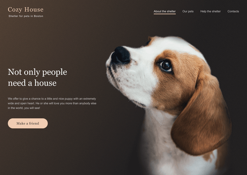

# [Shelter](https://igor-bochenkov.github.io/shelter/)

Двухстраничный веб-сайт приюта для животных.

- реализован адаптив под разные размеры экранов устройств
- реализованы плавные анимации на интерактивных элементах
- весь функционал написан на чистом JavaScript:
  - 'burger menu' на обеих страницах
  - слайдер-карусель на главной странице
  - пагинации на странице `Pets`
  - попапы на обеих страницах

https://igor-bochenkov.github.io/shelter/
